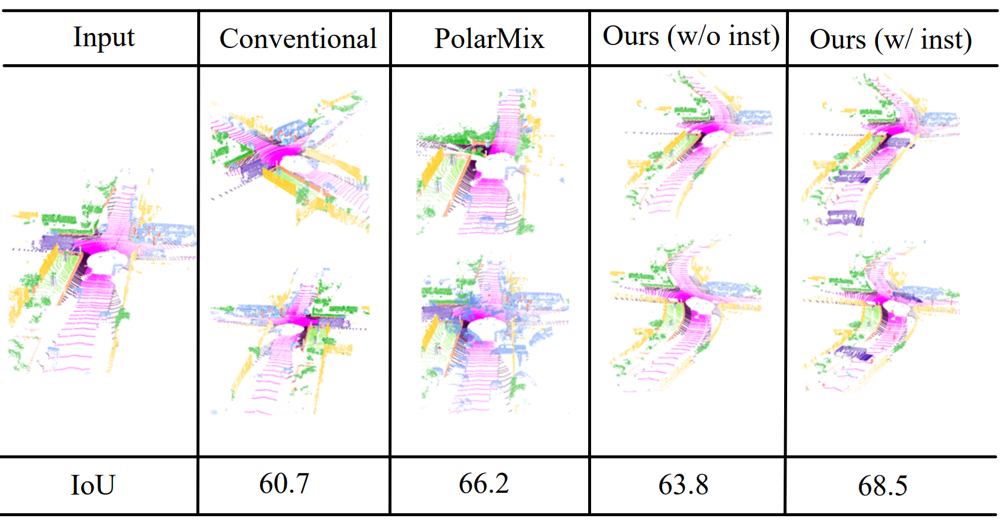
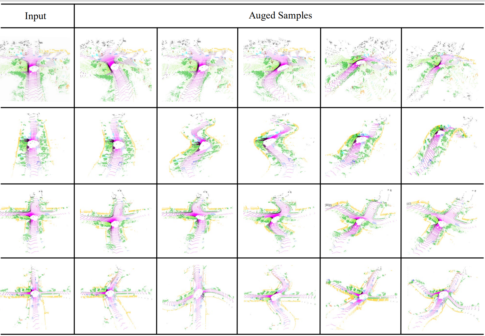

# SmoothDA

<pre>
Leveraging Smooth Deformation Augmentation for LiDAR Point Cloud Semantic Segmentation
Shoumeng Qiu, Jie Chen, Chenghang Lai, Hong Lu, Xiangyang Xue, Jian Pu
Corresponding-author: Jian Pu
</pre>

        

 

### Abstract

Existing data augmentation approaches on LiDAR point cloud are mostly developed on rigid transformation, such as rotation, flipping, or copy-based and mix-based methods, lacking the capability to generate diverse samples that depict smooth deformations in real-world scenarios. In response, we propose a novel and effective LiDAR point cloud augmentation approach with smooth deformations that can enrich the diversity of training data while keeping the topology of instances and scenes simultaneously. The whole augmentation pipeline can be separated into two different parts: scene augmentation and instance augmentation. To simplify the selection of deformation functions and ensure control over augmentation outcomes, we propose three effective strategies: residual mapping, space decoupling, and function periodization, respectively. We also propose an effective prior-based location sampling algorithm to paste instances on a more reasonable area in the scenes. Extensive experiments on both the SemanticKITTI and nuScenes challenging datasets demonstrate the effectiveness of our proposed approach across various baselines.

### Augmentation Pipeline

        

### Instances augmentation samples

        

### Scenes augmentation samples

        

### Code 

Our code is very easy to use, simply replace the loss function mmseg/models/loss/cross_entropy_loss.py under the mmsegmenation framework with the code we provide. 

For the training details, please refer to the instructions provided in mmsegmentation codebase [Train.md](https://github.com/open-mmlab/mmsegmentation/blob/master/docs/en/train.md). 

<pre>
Take the STDC model as an example:
STDC1:
CUDA_VISIBLE_DEVICES=0,1 PORT=29500 sh tools/dist_train.sh configs/stdc/stdc1_512x1024_80k_cityscapes.py 2
STDC2:
CUDA_VISIBLE_DEVICES=0,1 PORT=29500 sh tools/dist_train.sh configs/stdc/stdc2_512x1024_80k_cityscapes.py 2
</pre>

####

We thanks for the opensource [mmsegmentation](https://github.com/open-mmlab/mmsegmentation) codebase。 

